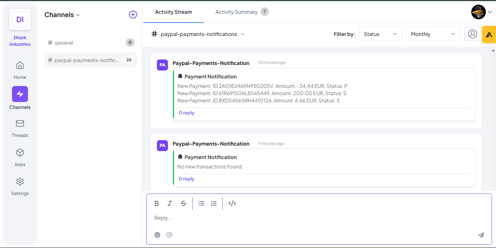

# PayPal Payment Monitor Integration Documentation

## Overview

PayPal Payment Monitor Integration is a Node.js-based Telex integration that polls the PayPal API for new transactions and posts payment alerts to a Telex channel. This integration helps teams keep track of incoming payments and monitor revenue in real-time. It is built as an interval integration, so Telex triggers it at specified intervals.

## What Is Telex?

Telex is an all-in-one monitoring solution for DevOps and software teams that enables real-time communication and event logging via HTTP webhooks. It supports bulk data ingestion and integrates with platforms like Slack, Discord, and Microsoft Teams for seamless message routing.

Link: [https://telex.im](https://telex.im)

## Endpoints

### 1. GET /integration-config

This endpoint retrieves integration details including settings, metadata, and the tick URL. Telex uses this information to display your integration in the marketplace and configure it in a channel.

#### Response Example:

```json
{
  "data": {
    "date": { "created_at": "2025-02-19", "updated_at": "2025-02-19" },
    "descriptions": {
      "app_name": "Paypal-Payments-Monitor",
      "app_description": "An integration that polls the PayPal API for new transactions and posts payment alerts to a Telex channel.",
      "app_logo": "https://cdn.brandfetch.io/id-Wd4a4TS/theme/dark/idCerXwXCa.svg?c=1bx1742623151377id64Mup7ac0_ViWH0a&t=1727787911932",
      "app_url": "https://your-deployment-url.com",
      "background_color": "#fff"
    },
    "is_active": true,
    "integration_category": "Finance & Payments",
    "integration_type": "interval",
    "key_features": [
      "Polls PayPal for transactions",
      "Formats alerts with transaction details",
      "Posts payment notifications to Telex",
      "Auto token refresh & error reporting",
      "Configurable polling interval"
    ],
    "author": "Your Name",
    "website": "https://your-deployment-url.com",
    "settings": [
      {
        "label": "paypalClientId",
        "type": "text",
        "required": true,
        "default": ""
      },
      {
        "label": "paypalSecret",
        "type": "text",
        "required": true,
        "default": ""
      },
      {
        "label": "Time interval",
        "type": "text",
        "required": true,
        "default": "*/5 * * * *"
      }
    ],
    "tick_url": "https://your-deployment-url.com/tick",
    "target_url": ""
  }
}
```

### 2. POST /tick

Telex calls this endpoint at the configured interval (using a cron expression) to trigger the monitoring process. The endpoint receives a POST payload that includes the channel ID, return URL, and integration settings. Your integration then:

- Authenticates with PayPal
- Fetches new transactions since the last tick
- Formats a notification message
- Sends the results back to Telex via the provided return URL.

#### Request Body Example:

```json
{
  "return_url": "https://telex-return-webhook-url.com/telex-channel-id",
  "settings": [
    {
      "label": "paypalClientId",
      "type": "text",
      "required": true,
      "default": "your-key"
    },
    {
      "label": "paypalSecret",
      "type": "text",
      "required": true,
      "default": "your-secret"
    },
    {
      "label": "interval",
      "type": "text",
      "required": true,
      "default": "*/25 * * * *"
    }
  ]
}
```

## How to Get PayPal API Credentials

### Sign in to PayPal Developer Dashboard:

- Visit [PayPal Developer](https://developer.paypal.com) and log in with your PayPal account.

### Create an Application:

- Navigate to **Dashboard > My Apps & Credentials**.
- Create a new app or select an existing one.
- Under the app details, you will find your Client ID and Secret.

### Use Sandbox Credentials for Testing:

- Make sure to use the sandbox environment (https://api.sandbox.paypal.com) for initial testing.
- Update your environment variables accordingly.

## How Payment Monitoring Works

### Polling Interval:

Telex triggers your /tick endpoint based on the crontab expression provided (e.g., every 25 minutes).

### Authentication and Transaction Fetching:

- Your integration uses the stored PayPal credentials to request an access token.
- It then queries the PayPal Reporting API for transactions occurring since the last tick.

### Filtering and Formatting:

- New transactions are filtered (to avoid duplicate notifications).
- Each new transaction is formatted into a human-readable message.

### Notification Routing:

- The integration posts the result to the return_url provided by Telex.
- The response payload follows Telex’s expected format:

```json
{
  "message": "Your notification message here",
  "username": "Paypal-Payments-Notification",
  "event_name": "Payment Notification",
  "status": "success"
}
```

## Installation

### Clone the Repository:

```bash
 git clone https://github.com/telexintegrations/PayPal-Payment-Monitor.git
 cd Paypal-Payments-Monitor
```

### Install Dependencies:

```bash
npm install
```

### Configure Environment Variables:

Create a `.env` file in the project root:

```env
PORT=3000
PAYPAL_API_URL=https://api.sandbox.paypal.com
```

### Run the Server:

```bash
node app.js
```

## Deployment

### Host your Integration:

Deploy your Node.js application on a cloud platform such as Heroku, Render, AWS, or similar.

### Register in Telex:

Provide your deployed URL (with /integration or /integration.json) on your organization’s Apps page in Telex.

### Configuration:

Configure the integration settings (e.g., PayPal credentials, polling interval) via Telex.

## Testing

### Local Testing:

Use Postman or curl to test the /health endpoint:

```bash
curl http://localhost:4000/health
```

### Simulate Tick Requests:

Send a POST request to `/tick` with a test payload:

```bash
curl -X POST http://localhost:4000/tick \
     -H "Content-Type: application/json" \
     -d '{
           "return_url": "https://your-test-return-url.com",
           "settings": [
             {"label": "paypalClientId", "type": "text", "required": true, "default": "your-paypal-ClientId"},
             {"label": "paypalSecret", "type": "text", "required": true, "default": "your-paypal-secret"},
             {"label": "interval", "type": "text", "required": true, "default": "*/5 * * * *"}
           ]
         }'
```

Check your logs and your test return URL (using a tool like [RequestBin](https://requestbin.com/)) to verify the response.

### Sandbox Testing:

Use your PayPal sandbox credentials to generate test transactions. Verify that your integration polls the PayPal API and sends out notifications accordingly.

## Integration Type

PayPal Payment Monitor Integration is an interval-based integration. Telex calls the `/tick` endpoint on a schedule (based on the provided cron expression), and your integration polls the PayPal API for new transactions. The results are then posted back to Telex via the `return_url`.

## Screenshots



## License

This project is licensed under the MIT License.
